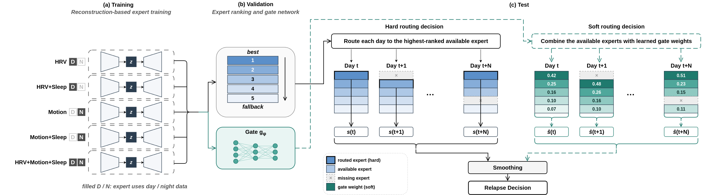

# Time-of-Day and Modality Experts for Wearable Relapse Detection in Psychotic Disorders

Official implementation of the paper *Time-of-Day and Modality Experts for Wearable Relapse Detection in Psychotic Disorders*.

Nikolaos Tsalkitzis, Olga Kontakioti, Petros Maragos, Niki Efthymiou


HERON, Hellenic Robotics Center of Excellence and School of ECE, National Technical University of Athens.

---

## Overview

Most wearable relapse-detection pipelines score every sensing modality through a single, modality-agnostic temporal window. This repository implements a framework of **time+modality specialised experts**: per-modality LSTM autoencoders trained for reconstruction, each tuned to a particular time-of-day window, and routed per patient and per day by either a **validation-ranked (hard)** policy or a **learned soft-gating** policy.

On a 14-patient e-Prevention cohort the best configuration reaches **AUROC 0.687, AUPRC 0.745, AVG 0.716**.



The pipeline has four stages:

1. **Train** one personalised LSTM autoencoder per patient, per feature set, per training regime (`train.py`).
2. **Score** each expert per day through per-window reconstruction error aggregated over the day, Eq. 1 (`evaluate_unimodal.py`).
3. **Route** across experts, either by validation ranking or by a masked-softmax gate, with an availability mask for missing modalities, Eq. 3 (`evaluate_gated_fusion.py`).
4. **Smooth** the daily score with a causal trailing filter of length N = 14 days, Eq. 2, and threshold.

Everything downstream of training is validation-tuned. No test label is read at any point, and no filter ever sees a future day.

---

## Repository layout

```
.
├── assets/
│   └── architecture.png          # Fig. 1
├── dataset.py                    # splits, per-patient scaling, windowing, FEATURE_COLS
├── model.py                      # LSTM autoencoder and reconstruction-error helpers
├── train.py                      # per-patient training, one checkpoint bundle per experiment
├── evaluate_unimodal.py          # single-expert evaluation, ensemble, diagnostics, signature
├── evaluate_gated_fusion.py      # hard ranking and soft gating over frozen experts
└── README.md
```

`dataset.py` owns every leakage-sensitive decision and is imported by all three scripts. It holds the constants that must be identical at train and test time.

---

## Requirements

```bash
python >= 3.10
torch >= 2.0
numpy
pandas
scikit-learn
matplotlib        # optional, only for the --signature heatmaps
```

```bash
pip install torch numpy pandas scikit-learn matplotlib
```

A GPU is not required. Each per-patient autoencoder is small and trains in seconds, but the pool is large (see the cost note below), so a GPU is recommended when building the full grid.

---

## Data

We evaluate on wearable recordings from the e-Prevention project. The data are not redistributable through this repository. See the dataset paper and the public challenge release for access:

- A. Zlatintsi et al., *E-Prevention: Advanced support system for monitoring and relapse prevention in patients with psychotic disorders*, Sensors 22:7544, 2022.
- P. P. Filntisis et al., *The 2nd E-Prevention challenge*, Proc. ICASSPW, 2024.

### Expected on-disk layout

The scripts consume the output of the feature-extraction stage, one CSV per week:

```
<features_dir>/
├── remission/
│   └── <user_id>/
│       └── <fold>/            # 5 remission folds per patient
│           └── <week>/
│               └── features.csv
└── relapse/
    └── <user_id>/
        └── <fold>/            # 2 relapse folds per patient
            └── <week>/
                └── features.csv
```

Each `features.csv` holds 5-minute bins with a `Timestamp` column, an optional `calendar_date` column and the feature columns listed below. `calendar_date` is what makes chronological ordering and calendar-gap detection possible downstream, so include it whenever available. A patient is used only if it has exactly 5 remission folds and 2 relapse folds, otherwise it is skipped with a warning.

Windows are 24 bins (2 hours) with stride 12 bins (1 hour), never spanning a day boundary or an internal time gap.

---

## Feature sets: choosing what an expert sees

**An expert is defined by the feature columns it reconstructs.** `dataset.FEATURE_COLS` is the single source of truth for that list. You select a feature set by restricting `FEATURE_COLS` before training, then training a dedicated checkpoint directory for it.

The full list contains 37 columns in four groups:

| Group | Count | Columns |
|---|---|---|
| **Motion** | 19 | `acc_{X,Y,Z}`, `acc_{X,Y,Z}_std`, `acc_{X,Y,Z}_zcr`, `gyr_{X,Y,Z}`, `gyr_{X,Y,Z}_std`, `gyr_{X,Y,Z}_zcr`, `activity_total_acc` |
| **HRV** | 11 | `heartRate_mean`, `heartRate_std`, `rRInterval_mean`, `rRInterval_rmssd`, `rRInterval_sdnn`, `rRInterval_lombscargle_{lf,hf,lf_hf}`, `rRInterval_{sd1,sd2,sd1_sd2}` |
| **Sleep** | 5 | `sleep_main_duration_h`, `sleep_main_onset_sin`, `sleep_main_onset_cos`, `sleep_fragmentation`, `sleep_onset_std_min` |
| **Time encoding** | 2 | `sin_t`, `cos_t` |

The two circadian encodings are kept in every expert. They give the autoencoder the position of a window within the day, which matters once the training regime is restricted.

### Three rules that are enforced by the code

1. **One checkpoint directory per (feature set, training regime).** `evaluate_gated_fusion.py` resolves a checkpoint by globbing `fold_{fold}_rel_{order}_*.pt` inside the directory and taking the first match, so a directory holding more than one regime is ambiguous.
2. **The feature list is frozen into the bundle.** Each checkpoint stores `feature_cols`, and `evaluate_unimodal.py` raises immediately if that list differs from what `dataset.py` currently defines. Editing `FEATURE_COLS` does not retrofit existing checkpoints, because the weights, `model_kwargs["input_dim"]` and the stored scaling artifacts are all bound to the training feature list. Retrain instead.
3. **Fusion reloads the list per expert.** `evaluate_gated_fusion.py` sets `ds.FEATURE_COLS` from each bundle before scoring it, which is what lets an HRV expert and a Motion expert be fused in a single run despite having different input dimensions.

### Optional convenience patch

The flat list can be replaced by a group selector so a feature set is picked from the command line rather than by editing the file. Paste this over the `FEATURE_COLS` definition in `dataset.py`:

```python
import os

MOTION_COLS = [
    "acc_X", "acc_X_std", "acc_Y", "acc_Y_std", "acc_Z", "acc_Z_std",
    "acc_X_zcr", "acc_Y_zcr", "acc_Z_zcr",
    "gyr_X", "gyr_X_std", "gyr_Y", "gyr_Y_std", "gyr_Z", "gyr_Z_std",
    "gyr_X_zcr", "gyr_Y_zcr", "gyr_Z_zcr",
    "activity_total_acc",
]
HRV_COLS = [
    "heartRate_mean", "heartRate_std",
    "rRInterval_mean", "rRInterval_rmssd", "rRInterval_sdnn",
    "rRInterval_lombscargle_hf", "rRInterval_lombscargle_lf",
    "rRInterval_lombscargle_lf_hf",
    "rRInterval_sd1", "rRInterval_sd2", "rRInterval_sd1_sd2",
]
SLEEP_COLS = [
    "sleep_main_duration_h", "sleep_main_onset_sin", "sleep_main_onset_cos",
    "sleep_fragmentation", "sleep_onset_std_min",
]
TIME_COLS = ["sin_t", "cos_t"]

_GROUPS = {"hrv": HRV_COLS, "motion": MOTION_COLS, "sleep": SLEEP_COLS}

# FEATURE_SET is a plus-separated list, e.g. "hrv", "motion+sleep", "all".
_requested = os.environ.get("FEATURE_SET", "all").lower()
_selected = list(_GROUPS) if _requested == "all" else _requested.split("+")
FEATURE_COLS: List[str] = (
    [c for g in _selected for c in _GROUPS[g]] + TIME_COLS
)
```

With that in place, `FEATURE_SET=hrv python train.py ...` trains an HRV expert without touching the source between runs. The rest of this README assumes the patch, and gives the manual-edit equivalent where it matters.

---

## Worked example: the HRV expert on the day window

This is the full path for one expert, from feature selection to a scored result.

**Step 1. Restrict the feature set to HRV.** With the patch, set `FEATURE_SET=hrv`. Without it, edit `dataset.FEATURE_COLS` to hold the 11 HRV columns plus `sin_t` and `cos_t`, 13 columns in total.

**Step 2. Train, restricted to the daytime regime.** `--tod day` filters the training bins, the per-patient scaling fit, and the validation days used for early stopping. Night is fixed at 22:00 to 07:00 and wraps midnight.

```bash
FEATURE_SET=hrv python train.py \
    --features-dir /path/to/features \
    --ckpt-dir ./checkpoints/hrv_day \
    --tod day \
    --night-start 22:00 --night-end 07:00 \
    --seed 0
```

This writes 10 bundles, `fold_{0..4}_rel_{0,1}_day.pt`, each holding one autoencoder per patient together with that patient's `(median, mean, std)` artifacts and the recorded val/test half assignment. Those two stored fields are what let evaluation rebuild an experiment exactly while learning nothing.

**Step 3. Score it on the day window.** The training regime is read from the bundle, so `--train-tod` only selects which checkpoint filenames to load.

```bash
FEATURE_SET=hrv python evaluate_unimodal.py \
    --features-dir /path/to/features \
    --ckpt-dir ./checkpoints/hrv_day \
    --train-tod day --test-tod day \
    --agg mean \
    --smooth-days 14 --smooth-mode linear --gap-days 7
```

**Step 4. Check the other scoring windows.** A single trained expert can be scored under a different window. A both-trained expert evaluated on day or on night is a clean pair, since it saw both regimes during training:

```bash
FEATURE_SET=hrv python evaluate_unimodal.py \
    --features-dir /path/to/features \
    --ckpt-dir ./checkpoints/hrv_both \
    --train-tod both --test-tod night \
    --smooth-days 14 --smooth-mode linear
```

A single-regime model evaluated on the opposite regime is out of distribution for both the time encoding and the scaling. The script logs `[CONFOUNDED]` in that case and the number should not be read as a clean relapse AUROC. The five meaningful pairs are `day/day`, `night/night`, `both/both`, `both/day` and `both/night`.

**Step 5. Retain the best pair on validation.** Table 1 of the paper is the result of this sweep, with the train/test pair chosen on validation days only. The selected pairs are:

| Feature set | Train regime | Test regime | Checkpoint directory |
|---|---|---|---|
| HRV | both | both | `checkpoints/hrv_both` |
| Motion | both | night | `checkpoints/motion_both` |
| Sleep | both | both | `checkpoints/sleep_both` |
| HRV+Sleep | day | day | `checkpoints/hrv_sleep_day` |
| HRV+Motion | both | day | `checkpoints/hrv_motion_both` |
| Motion+Sleep | both | night | `checkpoints/motion_sleep_both` |
| All | both | day | `checkpoints/all_both` |

Motion-bearing experts prefer the night window, HRV-bearing experts prefer the day, and the preference belongs to the expert as a whole rather than to any single modality.

---

## Building the full expert pool

The pool is the grid of feature sets by training regimes. Scoring windows are chosen afterwards at evaluation time, so only the training regime needs a separate directory.

```bash
FEATURES=/path/to/features

for fs in hrv motion sleep hrv+sleep hrv+motion motion+sleep all; do
  for tod in day night both; do
    tag=$(echo "$fs" | tr '+' '_')
    FEATURE_SET=$fs python train.py \
        --features-dir $FEATURES \
        --ckpt-dir ./checkpoints/${tag}_${tod} \
        --tod $tod \
        --seed 0
  done
done
```

**Cost.** This is 7 feature sets by 3 regimes by 10 experiments by 14 patients, so roughly 2940 small autoencoders. Each is fast because a patient holds a fraction of the cohort's data, but plan for hours rather than minutes. Use `--folds` and `--orders` to build a subset first, and `--patients` to restrict to a few user IDs while debugging.

If you only need the seven experts used by the routing policies, train just the regimes in the table above.

---

## Routing over the expert pool

Both policies operate on the same frozen pool. No gradient reaches an expert, and no expert is retrained or fine-tuned.

Each expert is declared with `--modality NAME=CKPTDIR[:TEST_TOD]`. The optional suffix overrides the scoring window, which is how the per-expert specialisation of Table 1 is expressed. Without a suffix the expert is scored in the regime it was trained in.

### Hard routing, validation ranking

Experts are ranked per patient on validation days by the mean of AUROC and AUPRC, and each test day goes to the highest-ranked expert whose required modalities are present.

```bash
python evaluate_gated_fusion.py \
    --features-dir /path/to/features \
    --modality hrv=./checkpoints/hrv_both:both \
    --modality motion=./checkpoints/motion_both:night \
    --modality sleep=./checkpoints/sleep_both:both \
    --modality hrv_sleep=./checkpoints/hrv_sleep_day:day \
    --modality hrv_motion=./checkpoints/hrv_motion_both:day \
    --modality motion_sleep=./checkpoints/motion_sleep_both:night \
    --modality all=./checkpoints/all_both:day \
    --fusion rank --rank-objective avg \
    --agg mean --day-policy union \
    --smooth-stage pre --smooth-days 14 --smooth-mode linear --gap-days 7 \
    --verbose-patient
```

`--verbose-patient` prints each patient's full ranking with per-expert validation scores, which is the readable form of the fallback order.

### Soft routing, learned gate

The gate consumes the validation-standardised expert scores, the binary availability mask, and optionally a coverage channel and a patient embedding, then emits masked-softmax weights. Unavailable experts are masked with negative infinity **before** the softmax, so an absent expert receives exactly zero weight. Graceful degradation is structural, not learned.

The gate head is zero-initialised, so at epoch 0 the gate is exactly masked mean fusion. Any departure from that baseline has to be earned on held-out validation days.

```bash
python evaluate_gated_fusion.py \
    --features-dir /path/to/features \
    --modality hrv=./checkpoints/hrv_both:both \
    --modality motion=./checkpoints/motion_both:night \
    --modality sleep=./checkpoints/sleep_both:both \
    --modality hrv_sleep=./checkpoints/hrv_sleep_day:day \
    --modality hrv_motion=./checkpoints/hrv_motion_both:day \
    --modality motion_sleep=./checkpoints/motion_sleep_both:night \
    --modality all=./checkpoints/all_both:day \
    --fusion gate --scope cohort \
    --gate-loss pairwise --gate-objective avg \
    --gate-hidden 16 --gate-epochs 300 --gate-lr 1e-2 --gate-l2 1e-3 \
    --gate-val-frac 0.25 --gate-split chrono \
    --agg mean --day-policy union \
    --smooth-stage pre --smooth-days 14 --smooth-mode linear --gap-days 7 \
    --dump-gate ./out/gate_days.csv
```

One gate is fitted per (fold, order) experiment on validation days pooled across patients. Epoch selection uses a held-out slice of those validation days, chronologically the last 25 percent per patient.

### Per-patient combiners

`--scope patient` fits a separate combiner on each patient's validation days. At this cohort size that is statistically fragile, roughly a hundred validation days against a few hundred gate parameters, so two hedges are available:

```bash
# per-patient gates warm-started from the cohort gate
--fusion gate --scope patient --gate-warm-start cohort

# per-patient simplex weights shrunk toward the cohort solution
--fusion weighted --scope patient --shrink 0.5
```

A patient whose validation days are single-class cannot be fitted and falls back to the cohort combiner. The count is logged per experiment. `--patient-embed` is forced to 0 under `--scope patient`, because a gate that only ever sees one patient has nothing to embed and the warm start requires a shared architecture.

---

## Baselines and controls

All of these run on the same expert pool and the same union day set, which is what makes them comparable.

| Row in Table 2 | How to run |
|---|---|
| Personalised LSTM-AE | `evaluate_unimodal.py --ckpt-dir ./checkpoints/all_both --train-tod both --smooth-days 1` |
| + causal smoothing | as above with `--smooth-days 14 --smooth-mode linear --gap-days 7` |
| Fixed window (day) | fusion with `:day` forced on every `--modality`, `--fusion rank` |
| Fixed window (night) | fusion with `:night` forced on every `--modality`, `--fusion rank` |
| Time-swapped routing | fusion with each expert's window reversed relative to the Table 1 selection (`:night` where the table says day, `:day` where it says night) |
| Random routing | replace the validation ranking with a random permutation in `_rank_experts_on_val`, keeping the pool intact |
| Ranked routing (hard) | `--fusion rank` with the Table 1 windows |
| Gated routing (soft) | `--fusion gate` with the Table 1 windows |
| Single expert | `--fusion single:hrv`, scored only on days that expert is available |
| Masked mean / max | `--fusion mean`, `--fusion max` |
| Validation-tuned weights | `--fusion weighted --weight-step 0.1 --weight-objective avg` |

Random routing is the one control without a dedicated flag. It is a two-line change inside `_rank_experts_on_val`, and it isolates the contribution of patient-specific ranking from the mere existence of a candidate pool.

The late-fusion reference is the detector of Tsalkitzis et al., EUSIPCO 2026, retrained on this patient set. It is not part of this repository.

---

## Hyperparameters

### Autoencoder and training (`train.py`)

| Parameter | Flag | Value |
|---|---|---|
| Hidden size | `--hidden` | 64 |
| Latent size | `--latent` | 4 |
| LSTM layers | `--layers` | 1 |
| Dropout | `--dropout` | 0.0 |
| Optimiser | fixed | Adam |
| Learning rate | `--lr` | 1e-3 |
| Batch size | `--batch-size` | 128 |
| Max epochs | `--epochs` | 100 |
| Early-stopping patience | `--patience` | 10 |
| Early-stopping monitor | fixed | patient's own validation-normal reconstruction MSE |
| Objective | fixed | MSE reconstruction |
| Training regime | `--tod` | `day` \| `night` \| `both` |
| Night boundary | `--night-start`, `--night-end` | 22:00 to 07:00 |
| Seed | `--seed` | seeds weight init and the half-assignment RNG |

### Windowing and splits (`dataset.py`, constants)

| Parameter | Value |
|---|---|
| Bin length | 5 minutes |
| Window length | 24 bins (2 hours) |
| Stride | 12 bins (1 hour, 50 percent overlap) |
| Remission folds | 5 |
| Relapse folds | 2 |
| Experiments per configuration | 10 (5 folds by 2 relapse orderings) |
| Imputation | per-patient median, fit on training remission bins only |
| Scaling | per-patient standardisation, fit on the same bins, then frozen |

Window geometry is written into every checkpoint and read back at evaluation, so checkpoints trained at different window lengths can be evaluated in one run without editing `dataset.py`.

### Scoring and smoothing (both evaluation scripts)

| Parameter | Flag | Default | Notes |
|---|---|---|---|
| Within-day aggregation | `--agg` | `mean` | `mean`, `median`, `p90`, `p95`, `max`. Tail statistics sharpen partial-day anomalies and tend to raise AUPRC |
| Smoother width N | `--smooth-days` | 14 in fusion, 1 in unimodal | 1 disables smoothing, keeping only chronological ordering |
| Smoother weights | `--smooth-mode` | `mean` | `linear` is Eq. 2, linearly increasing trailing weights |
| Trim fraction | `--trim` | 0.2 | `trimmed` mode only |
| Segment boundary | `--gap-days` | 7 | A calendar gap larger than this resets the filter |
| Smoother placement | `--smooth-stage` | `post` | `post` smooths the fused series, `pre` fuses already-smoothed expert scores |
| Trailing window convention | `--smooth-window` | `records` | `records` counts available days, `days` counts calendar days |
| Threshold | fixed | best-F1 on validation days | Never tuned on test |

### Gate (`evaluate_gated_fusion.py`)

| Parameter | Flag | Default |
|---|---|---|
| Hidden units | `--gate-hidden` | 16 (0 gives a linear gate) |
| Epochs | `--gate-epochs` | 300 |
| Learning rate | `--gate-lr` | 1e-2 |
| Weight decay | `--gate-l2` | 1e-3 |
| Loss | `--gate-loss` | `pairwise`, a smooth AUROC surrogate over within-patient relapse/remission day pairs |
| Max pairs per step | `--gate-max-pairs` | 20000 |
| Epoch-selection criterion | `--gate-objective` | `avg` |
| Held-out validation fraction | `--gate-val-frac` | 0.25 |
| Held-out split rule | `--gate-split` | `chrono`, the last portion of each patient's validation days |
| Entropy regulariser | `--gate-entropy-reg` | 0.0, larger values pull the gate toward masked mean fusion |
| Coverage channel | `--gate-use-coverage` | off |
| Patient embedding width | `--patient-embed` | 0 |
| Combiner scope | `--scope` | `cohort` |
| Day set | `--day-policy` | `union`, a day survives if any expert scored it |


## Citation

```bibtex
@inproceedings{tsalkitzis2027timeofday,
  title     = {Time-of-Day and Modality Experts for Wearable Relapse Detection
               in Psychotic Disorders},
  author    = {Tsalkitzis, Nikolaos and Kontakioti, Olga and
               Maragos, Petros and Efthymiou, Niki},
  booktitle = {Proc. IEEE International Conference on Acoustics, Speech and
               Signal Processing (ICASSP)},
  year      = {2027}
}
```

Related work from the same group:

```bibtex
@inproceedings{tsalkitzis2026uncertainty,
  title     = {Uncertainty-Driven Anomaly Detection for Psychotic Relapse Using
               Smartwatches: Forecasting and Multi-Task Learning Fusion},
  author    = {Tsalkitzis, Nikolaos and Filntisis, Panagiotis P. and
               Maragos, Petros and Efthymiou, Niki},
  booktitle = {Proc. EUSIPCO},
  year      = {2026}
}
```

---

## Acknowledgment

This project is funded by the European Union under Horizon Europe, grant No. 101136568, HERON.

## Contact

Nikolaos Tsalkitzis, `n.tsalkitzis@athenarc.gr`
